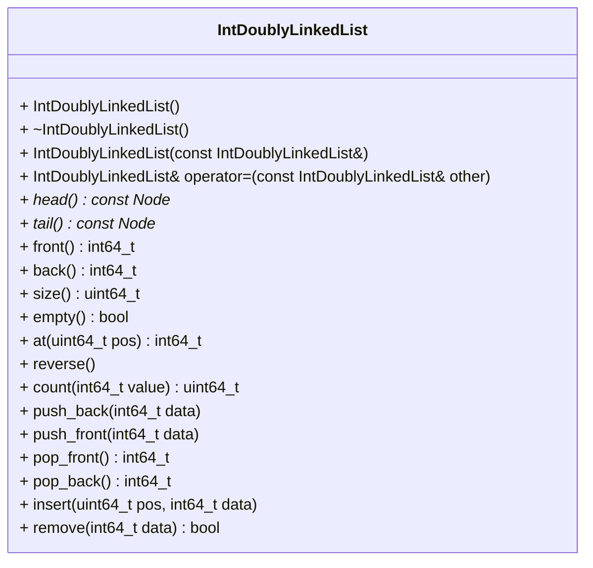

# Doubly Linked List for Integers (`int64_t`)

A doubly linked list for storing integers is to be created. In contrast to a
singly linked list, every node stores a pointer to its successor *and* a
pointer to its predecessor. Therefore, adding and removing elements at both
ends of the list must be implemented in $O(1)$ time complexity. Every node
must be allocated individually on the heap. Using containers of the standard
library (e.g. `std::list` or `std::vector`) for storing the elements is not
allowed.

This repository contains a `CMakeLists.txt` file that is already sufficient
for the project. It also contains some automated tests that provide feedback
on your progress. To receive full points, the following API must be declared
in `int_dll.hpp`. Its implementation must be realized in `int_dll.cpp`.
You have to correctly declare the member functions' `const`-ness in order to
allow the provided auto-tests to compile. Place all your declarations and
definitions inside the appropriate namespace (the namespace name must match
the namespace used in the provided test cases).

After finishing the below tasks, run the following commands to see if your code
is correct. Note that a current version of `libcatch` has to be installed
to compile.

```shell
mkdir build && cd build
cmake ..
make -j4
./int_dll_test
```

The following class diagram gives an overview of the required API.



Unlike the singly linked list, we now implement `pop_back` as well. As the
last element has a pointer to the second last element, the new last element
can be found in $O(1)$. The functions `at(.)`, `insert(.)`, `remove(.)` and
`count(.)` are still $O(n)$. As the list can be traversed in both directions,
`at(.)` may start at the end that is closer to `pos`.

Note that adding or removing a node requires updating the pointers of both
neighbouring nodes as well as the pointers to the first and the last node of
the list.

In addition to the class, implement the following operator as non-member.

```cpp
std::ostream& operator<<(std::ostream& os, const ds::IntDoublyLinkedList& dll);
```

## Required behavior
`IntDoublyLinkedList()` create an empty list  
`~IntDoublyLinkedList()` free all heap-allocated resources  
`IntDoublyLinkedList(const IntDoublyLinkedList&)` create an independent copy  
`IntDoublyLinkedList& operator=(const IntDoublyLinkedList& other)` replace the
  content with an independent copy of `other`; the old nodes must be freed and
  self-assignment (`list = list`) must leave the list unchanged  

`const Node* head()` return pointer to immutable first element (for testing)  
`const Node* tail()` return pointer to immutable last element (for testing)  
`int64_t front()` return data (value) of first element  
`int64_t back()` return data (value) of last element  
`uint64_t size()` return the number of elements in the list  
`bool empty()` return `true` if the list is empty, `false` otherwise  
`int64_t at(uint64_t pos)` return the element at the position `pos`  
`void reverse()` reverse the order of the elements in-place (without creating
  new nodes)  

`uint64_t count(int64_t value)` return the number of occurrences of
  `value` in the list  

`void push_back(int64_t data)` add `data` to the back of the list  
`void push_front(int64_t data)` add `data` to the front of the list  
`int64_t pop_front()` remove the first element and return its data  
`int64_t pop_back()` remove the last element and return its data  
`void insert(uint64_t pos, int64_t data)` insert `data` in front of the
  element at position `pos`, i.e. `at(pos)` returns `data` afterwards;
  `pos == size()` adds `data` to the back of the list  
`bool remove(int64_t data)` remove the first element storing `data`; return
  `true` if an element was found and removed, `false` otherwise  

`front()`, `back()`, `pop_front()` and `pop_back()` must throw an exception
(e.g. `std::out_of_range`) if the list is empty. `at(pos)` must throw if `pos`
is out of bounds, `insert(pos, data)` must throw if `pos > size()`.

`std::ostream& operator<<(std::ostream& os, const IntDoublyLinkedList& dll)`
print all elements from front to back, e.g. `dll[10, 5, 20]`; an empty list
is printed as `dll[]`

The implementation of the list may, of course, use additional private 
member functions.


# Grading
This task will primarily be graded using autotests. You also need
to maintain a consistent coding style. In particular, all identifiers and
comments have to be in English!
